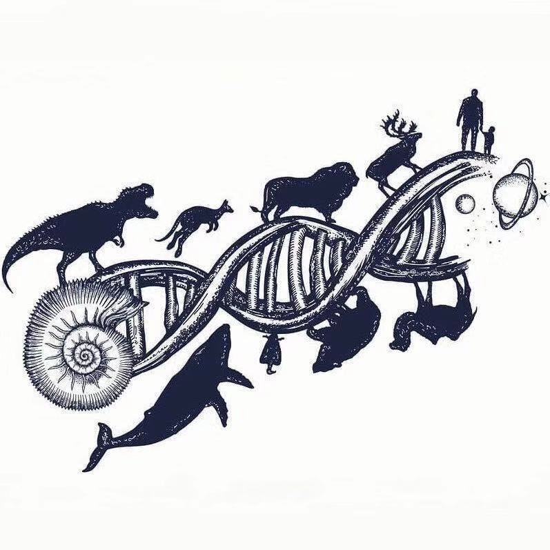

# 我的博客

## 封面



## GitHub博客链接

[https://github.com/wzipone/blog-test/blob/master/README.md](https://github.com/wzipone/blog-test/blob/master/README.md)


## 我的兴趣

1. 唱
2. 跳
3. rap
4. 篮球

## 去过的城市

* 北京
* 上海
* 广东

## 第一行HTML

`<h1>hello world!</h1>`

## 第一段JS代码

```javascript
var i=0;
console.log("hello world!")
```